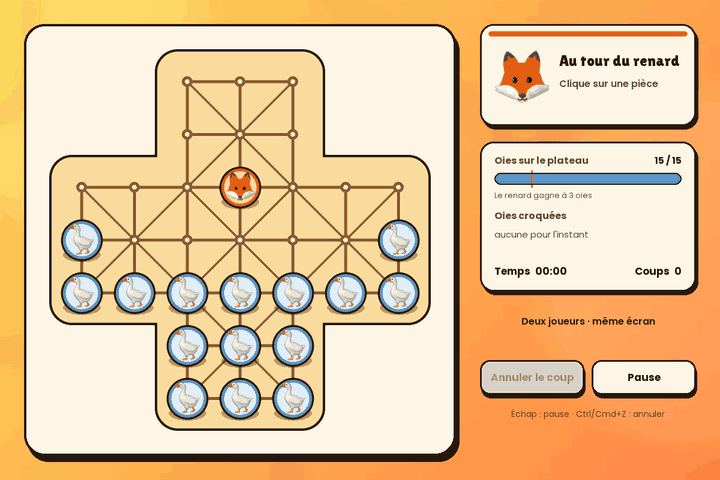
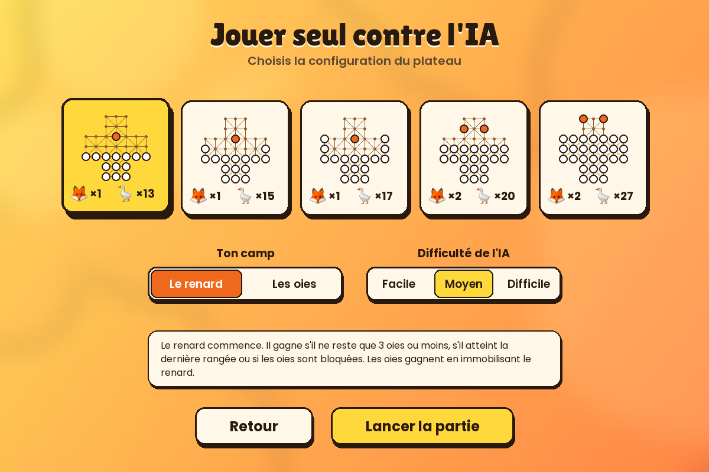
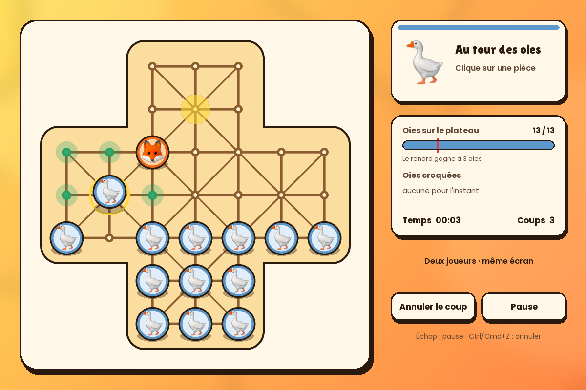
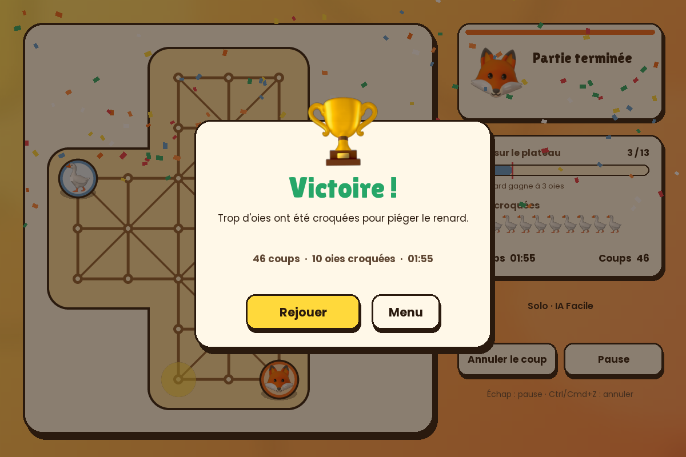

<div align="center">

# 🦊 Fox and Geese 🪿

**Le renard rusé contre la bande d'oies** — un jeu de plateau du Moyen Âge, en Python.<br>
Contre l'IA, à deux sur le même écran, ou **en ligne avec un ami**.


### ⬇️ Télécharger

[**Windows (.zip)**](../../releases/latest/download/FoxAndGeese-Windows.zip) ·
[**Mac Apple Silicon (.zip)**](../../releases/latest/download/FoxAndGeese-Mac.zip)



</div>

## Tester en une minute

Aucune installation : on télécharge et on lance.

**Windows 10 / 11**
1. Télécharge `FoxAndGeese-Windows.zip`. Si le navigateur hésite (« fichier rarement
   téléchargé ») : dans la liste des téléchargements, **… → Conserver** (Edge) ou
   **Conserver** (Chrome).
2. Clic droit sur le zip → **Extraire tout**, ouvre le dossier `FoxAndGeese`, double-clique
   sur **`FoxAndGeese.exe`**.
3. Windows affiche « Windows a protégé votre ordinateur » : le jeu n'est pas signé
   numériquement (un certificat coûte plusieurs centaines d'euros par an). Clique sur
   **Informations complémentaires → Exécuter quand même**.

**Mac (puces Apple M1 et plus récentes)**
1. Télécharge `FoxAndGeese-Mac.zip`, dézippe-le, glisse « Fox and Geese » dans Applications.
2. Au premier lancement, macOS le bloque (app non notariée par Apple). Va dans
   **Réglages Système → Confidentialité et sécurité**, tout en bas : **Ouvrir quand même**.

**Tester le mode en ligne tout seul** : lance le jeu sur deux ordinateurs (ou deux fois sur
Windows). Sur le premier : *Jouer en ligne → Créer une partie* ; sur le second :
*Rejoindre* et tape le code affiché.

Un bug, une idée ? [Ouvre une *issue*](../../issues/new/choose).

## Ce qu'il y a dedans

- **Seul contre l'IA** : tu choisis ton camp (renard ou oies) et le niveau (Facile, Moyen, Difficile).
- **Deux joueurs sur le même écran.**
- **En ligne entre amis** : un code à 5 caractères suffit, d'une maison à l'autre, sans
  rien configurer. Revanche avec camps inversés.
- **5 configurations** : 1 renard contre 13, 15 ou 17 oies ; 2 renards contre 20 ou 27.
- Annulation de coup, sauvegarde automatique, plein écran (F11), musique et bruitages.

| Choisir sa partie | Jouer | Gagner |
|---|---|---|
|  |  |  |

## Règles

- Chaque pièce avance d'une intersection **en suivant les lignes**. Les diagonales
  n'existent que là où elles sont dessinées.
- Le **renard** va dans toutes les directions. Il **capture** en sautant par-dessus une oie
  voisine si la case derrière est libre, et peut enchaîner les sauts (rafle).
- Les **oies** avancent ou vont sur le côté, jamais en arrière. Elles ne capturent pas.
- Le **renard gagne** s'il reste moins de 4 oies par renard, s'il atteint la dernière
  rangée, ou si les oies ne peuvent plus bouger.
- Les **oies gagnent** si aucun renard ne peut bouger.
- **Match nul** si la même position revient trois fois.

## Lancer depuis le code

Nécessite Python 3.10 ou plus récent.

```bash
git clone <adresse du dépôt>      # bouton vert « Code » en haut de la page
cd PROJET-PYTHON-FOX-AND-GEESE
python3 -m venv .venv
source .venv/bin/activate          # Windows : .venv\Scripts\activate
pip install -r requirements.txt
python main.py
```

Tests : `pip install -r requirements-dev.txt && python -m pytest`
(l'un d'eux joue une vraie partie en ligne à deux : il faut une connexion internet).

## Comment c'est construit

| Fichier | Rôle |
|---|---|
| [`foxgeese/rules.py`](foxgeese/rules.py) | Règles pures : plateau, coups, captures, victoire. Aucun affichage. |
| [`foxgeese/ai.py`](foxgeese/ai.py) | IA minimax avec élagage alpha-bêta et approfondissement itératif. |
| [`foxgeese/net.py`](foxgeese/net.py) | Mode en ligne via un relais MQTT public. |
| [`foxgeese/game.py`](foxgeese/game.py) | Écran de partie : plateau animé, IA en arrière-plan, synchronisation en ligne. |
| [`foxgeese/scenes.py`](foxgeese/scenes.py) | Menus, configuration, salon en ligne, règles. |
| [`foxgeese/ui.py`](foxgeese/ui.py) | Thème, mise à l'échelle (Retina / 4K), widgets. |
| [`foxgeese/storage.py`](foxgeese/storage.py) | Sauvegarde et réglages dans le dossier utilisateur. |
| [`tests/`](tests) | 20 tests automatiques. |
| [`archive-2023/`](archive-2023) | Version originale de 2023 (Tkinter) et sa documentation. |

**Mode en ligne.** Pour éviter d'avoir à ouvrir des ports sur sa box, les deux jeux passent
par un relais MQTT public et gratuit (`broker.emqx.io`, avec `broker.hivemq.com` et
`test.mosquitto.org` en secours). Chaque partie a son « salon », identifié par le code.
Les deux jeux appliquent les mêmes règles et vérifient chaque coup reçu. Limites : le relais
est public, donc les messages (coups et pseudos, rien d'autre) ne sont pas privés, et le
mode en ligne dépend de la disponibilité de ces services gratuits.

**Versions Windows et Mac.** Compilées par GitHub Actions
([`build.yml`](.github/workflows/build.yml)) avec PyInstaller. Avant publication, le vrai
exécutable est lancé en mode auto-test : il ouvre une partie, fait jouer l'IA et contacte le
relais en ligne. Publier une version : `git tag vX.Y.Z && git push --tags`.

## Historique

Projet étudiant de fin d'année (2023), écrit à l'origine avec Tkinter.
Remasterisé en 2026 : nouveau moteur graphique, vraie IA, mode en ligne et correction des
bugs de la première version, entre autres :

- plantage au lancement avec Pillow ≥ 10 (`Image.ANTIALIAS` supprimé) ;
- plateau de départ modifié en place : une deuxième partie démarrait avec le plateau de la précédente ;
- l'IA restait active en mode 2 joueurs après une partie solo ;
- appel à une fonction inexistante quand le renard atteignait le fond du plateau ;
- victoire détectée deux fois, et la partie continuait après la fin ;
- sauvegarde écrite dans le dossier courant (échouait une fois compilé en .exe) ;
- chronomètres qui s'accumulaient à chaque nouvelle partie ; pause qui n'empêchait pas de jouer ;
- déplacements qui ne suivaient pas les lignes d'un vrai plateau.

## Crédits

- Musique de fond : « Mr Key » (d'après les métadonnées du fichier), reprise de la version 2023.
- Illustrations renard, oie, trophée : [Noto Emoji](https://github.com/googlefonts/noto-emoji) de Google — licence Apache 2.0.
- Polices : [Poppins](https://fonts.google.com/specimen/Poppins) et [Lilita One](https://fonts.google.com/specimen/Lilita+One) — licence SIL Open Font.
